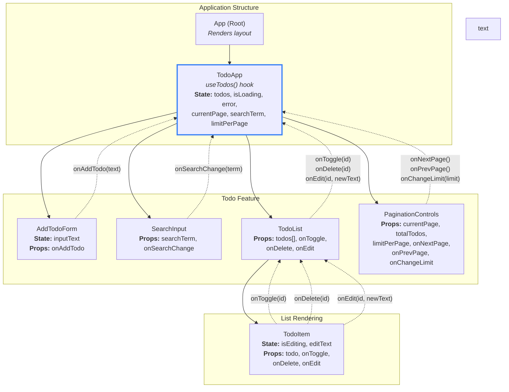

## Component Tree & Data Flow Diagram
### Diagram

### Diagram Explained

#### **App** (Root Component)
- Кореневий компонент додатку
- Просто рендерить компонент `TodoApp`
- Не містить жодного стану додатку

---

#### **TodoApp** (Smart Component)
**Роль:** Головний контейнер і "розумний" компонент

**Керування станом:** Викликає кастомний хук `useTodos()` і отримує:
- `todos` — відфільтрований масив завдань (на основі `searchTerm`)
- `isLoading` — індикатор завантаження даних
- `error` — повідомлення про помилку
- `currentPage` — поточний номер сторінки
- `totalTodos` — загальна кількість завдань
- `limitPerPage` — кількість завдань на сторінці
- `searchTerm` — поточний пошуковий запит

**Функції:**
- `addTodo(text)` — додати нове завдання
- `toggleTodo(id)` — перемкнути статус виконання
- `deleteTodo(id)` — видалити завдання
- `editTodoText(id, newText)` — редагувати текст завдання
- `goToNextPage()` — перейти на наступну сторінку
- `goToPrevPage()` — перейти на попередню сторінку
- `changeLimit(limit)` — змінити кількість завдань на сторінці
- `setSearchTerm(term)` — оновити пошуковий запит

**Потік даних вниз:** Передає всі необхідні дані та функції дочірнім компонентам через пропси

**Умовний рендеринг:** Відображає стани завантаження та помилок

---

#### **AddTodoForm** (Presentational Component)
**Роль:** Компонент для додавання нових завдань

**Локальний стан:** `inputText` — текст нового завдання

**Пропси:** `onAddTodo` — колбек для додавання завдання

**Колбек вгору:** При відправці форми викликає `onAddTodo(newTodoText)`

---

#### **SearchInput** (Presentational Component)
**Роль:** Поле пошуку для фільтрації завдань в реальному часі

**Пропси:**
- `searchTerm` — поточне значення пошуку
- `onSearchChange` — колбек для оновлення пошуку

**Колбек вгору:** При зміні тексту викликає `onSearchChange(term)`

**Особливості:** Фільтрація відбувається на стороні клієнта без перезавантаження

---

#### **TodoList** (Presentational Component)
**Роль:** Відображає список завдань

**Пропси:**
- `todos` — масив об'єктів завдань
- `onToggle` — колбек для перемикання статусу
- `onDelete` — колбек для видалення
- `onEdit` — колбек для редагування

**Умовний рендеринг:** Якщо масив порожній, показує повідомлення "No tasks yet. Add one!"

**Рендеринг списку:** Перебирає масив `todos` і рендерить `TodoItem` для кожного завдання

---

#### **TodoItem** (Presentational Component)
**Роль:** Відображає одне завдання з чекбоксом, кнопками редагування та видалення

**Локальний стан:**
- `isEditing` — режим редагування (boolean)
- `editText` — тимчасовий текст під час редагування

**Пропси:**
- `todo` — об'єкт завдання з полями `id`, `todo`, `completed`
- `onToggle` — колбек
- `onDelete` — колбек
- `onEdit` — колбек

**Колбеки вгору:**
- `onToggle(todo.id)` — при кліку на чекбокс
- `onDelete(todo.id)` — при кліку на кнопку видалення
- `onEdit(todo.id, newText)` — при збереженні редагування

**Візуальний зворотний зв'язок:** Закреслений текст для виконаних завдань, inline-редагування

---

#### **PaginationControls** (Presentational Component)
**Роль:** Керування пагінацією та вибір кількості елементів на сторінці

**Пропси:**
- `currentPage` — поточна сторінка
- `totalTodos` — загальна кількість завдань
- `limitPerPage` — кількість завдань на сторінці
- `onNextPage` — колбек для наступної сторінки
- `onPrevPage` — колбек для попередньої сторінки
- `onChangeLimit` — колбек для зміни ліміту

**Колбеки вгору:**
- `onNextPage()` — при кліку на "Next"
- `onPrevPage()` — при кліку на "Previous"
- `onChangeLimit(limit)` — при виборі нового значення у select

**Умовний рендеринг:** Автоматично відключає кнопки на першій/останній сторінці

**Додаткові елементи:** Dropdown-меню для вибору кількості (5, 10, 15, 20, 30)