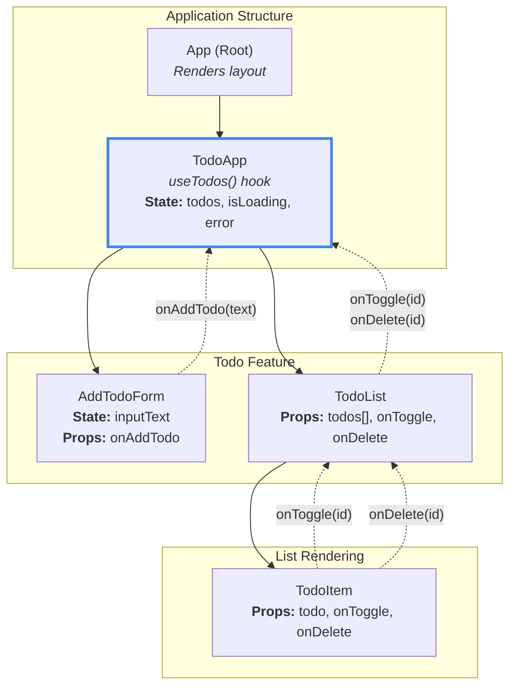

## Component Tree & Data Flow Diagram
### Diagram

## Diagram Explained
### App
The root component that renders the main application layout.

Simply renders TodoApp component.

Holds no application state.

TodoApp (Smart Component)
Primary Role: The main container and "smart" component.

State Management: Calls the useTodos() custom hook to get:

todos — array of todo objects

isLoading — boolean indicating data fetch status

error — error message if fetch fails

addTodo — function to add a new todo

toggleTodo — function to toggle todo completion status

deleteTodo — function to delete a todo

Data Down: Passes addTodo function to AddTodoForm.

Data Down: Passes todos array, toggleTodo, and deleteTodo functions to TodoList.

Conditional Rendering: Displays loading state or error messages when appropriate.

AddTodoForm (Presentational Component)
Role: A "dumb" component responsible only for capturing user input.

Local State: Manages inputText using useState.

Props: Receives onAddTodo callback function.

Callback Up: On form submission, invokes onAddTodo(newTodoText), sending the new task's content up to TodoApp to be processed by the useTodos hook.

TodoList (Presentational Component)
Role: Receives the todos array and renders the list.

Props:

todos — array of todo objects to display

onToggle — callback to toggle completion status

onDelete — callback to delete a todo

Conditional Rendering: If the array is empty, displays a "No tasks yet" message.

List Rendering: Maps over the todos array and renders a TodoItem for each todo, passing down the todo object and callback functions.

TodoItem (Presentational Component)
Role: Displays a single todo with a checkbox and delete button.

Props:

todo — the todo object with id, todo (text), and completed properties

onToggle — callback function

onDelete — callback function

Callback Up:

Invokes onToggle(todo.id) when the checkbox is clicked.

Invokes onDelete(todo.id) when the delete button is clicked.

Visual Feedback: Applies line-through styling to completed todos.